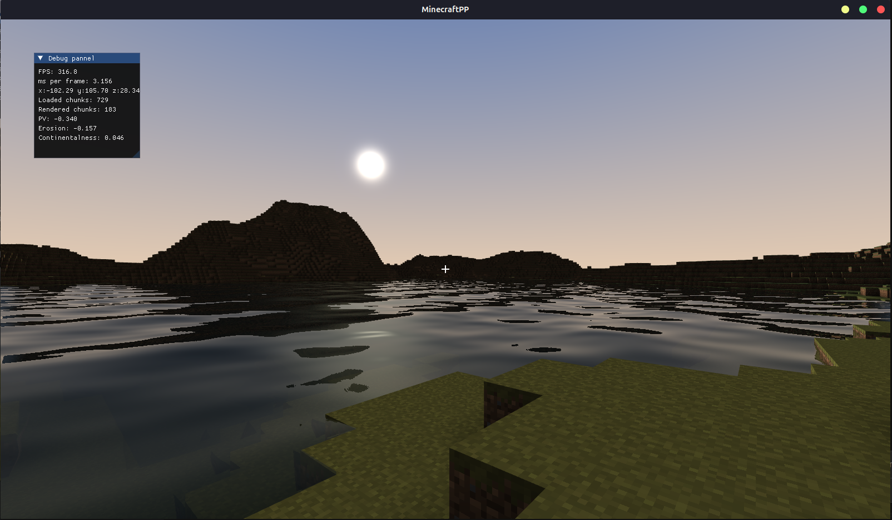
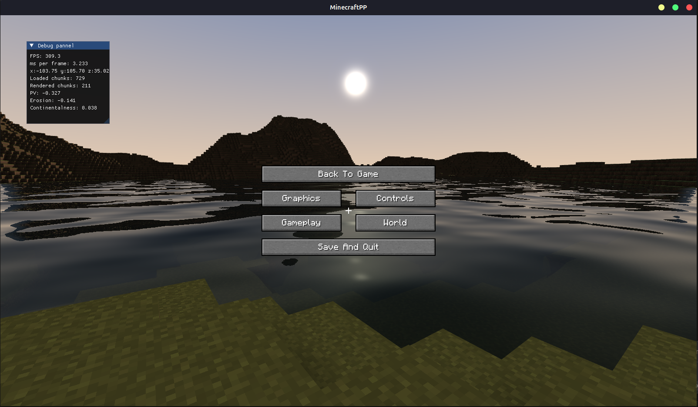

<div align="center">

# MinecraftPP

**A voxel sandbox engine written from scratch in modern C++ and OpenGL.**

<!-- TODO: replace with real badges once CI is set up -->




</div>

---

## About

MinecraftPP is a personal project exploring what it takes to build a Minecraft-like game
without an existing engine. Everything from chunk management and terrain generation to the
rendering pipeline, lighting, shadows and user interface is implemented by hand, on top of a
small set of low-level libraries (GLFW, glad, GLM, stb, Dear ImGui).

The goal is both to learn real-time graphics and engine architecture in depth, and to end up
with a clean, documented codebase that can grow into a reusable engine.

## Features

### Rendering
- **Chunk meshing** with face culling and packed vertex data to keep GPU memory low
- **Per-vertex ambient occlusion** for soft contact shadows between blocks
- **Cascaded shadow maps** with PCF filtering for sun shadows across large view distances
- **Water rendering** with refraction, depth-based fog and **screen-space reflections**
- **Skybox**
- **Frustum culling** of chunks
- **Texture atlas** with manually generated mipmaps per tile
- **Biome tinting** for grass and foliage, driven by per-column temperature and humidity

### World generation
- **Multi-noise terrain** inspired by modern Minecraft: continentalness, erosion and
  peaks & valleys noises remapped through editable splines
- **Fractal Perlin noise** implementation
- **Live terrain editor**: tweak noises and splines in-game and regenerate the world instantly
- **Parallel chunk generation and meshing** on a thread pool, without blocking the main thread

### Gameplay
- **Survival movement** with gravity, jumping and per-axis AABB collision resolution
- **Block raycasting** with a highlighted outline on the targeted block
- **Block breaking and placing**
- **Zoom** with the mouse wheel

### Interface and tooling
- **Custom 2D renderer** for the HUD (icons, text, quads) and the in-game settings menu
- **Settings registry** that exposes engine parameters (FOV, graphics options…) to the UI
- **Debug panel** built with Dear ImGui and ImPlot (frame times, world stats, terrain tools)

## Screenshots


*In-game settings menu, drawn with the custom HUD renderer*

## Getting started

### Prerequisites

- **CMake** 3.20 or newer
- A **C++20** compiler: MSVC 2022, GCC 11+ or Clang 14+
- A GPU and driver supporting **OpenGL 3.3 core profile**
- **Git** (dependencies are downloaded automatically with CMake `FetchContent`)

On Linux, GLFW also needs the windowing development packages. On Debian/Ubuntu:

```bash
sudo apt install libx11-dev libxrandr-dev libxinerama-dev libxcursor-dev libxi-dev \
                 libwayland-dev libxkbcommon-dev
```

### Building

```bash
git clone https://github.com/icer34/MinecraftPP.git
cd MinecraftPP
cmake -S . -B build -DCMAKE_BUILD_TYPE=Release
cmake --build build --config Release
```

The first configuration takes a little longer, since CMake downloads GLFW, GLM, Dear ImGui,
ImPlot, stb and BS::thread_pool.

### Running

Shaders and assets are copied next to the executable at build time, so the game can be
launched directly from the build directory:

```bash
# Single-config generators (Makefiles, Ninja)
./build/MinecraftPP

# Multi-config generators (Visual Studio, Xcode)
./build/Release/MinecraftPP
```

### Build options

| Option | Default | Description |
|---|---|---|
| `ENABLE_ASAN` | `OFF` | Builds the engine, game and tests with AddressSanitizer to track memory errors |
| `BUILD_DOCS` | `OFF` | Adds a `docs` target that generates the Doxygen documentation |

Example:

```bash
cmake -S . -B build-asan -DENABLE_ASAN=ON
```

### Tests

The engine is built as a static library (`engine_lib`), linked both by the game and by a
separate test executable:

```bash
cmake --build build --target tests
./build/tests
```

### Documentation

The API documentation is generated with [Doxygen](https://www.doxygen.nl/):

```bash
cmake -S . -B build -DBUILD_DOCS=ON
cmake --build build --target docs
```

The HTML output is written to `docs/html/index.html`.

<!-- TODO: add the GitHub Pages link once the docs are published -->

## Controls

| Input | Action |
|---|---|
| `W` `A` `S` `D` | Move |
| `Space` | Jump |
| Mouse | Look around |
| Left click | Break block |
| Right click | Place block |
| Mouse wheel | Zoom in / out |
| `F3` | Toggle debug panel |
| `Esc` | Open / close settings menu |

## Project structure

```
MinecraftPP/
├── assets/           Textures (blocks, colormaps, GUI)
├── libs/             Vendored libraries (glad)
├── shaders/          GLSL shaders (blocks, water, sky, shadows, HUD)
├── src/
│   ├── game/         World, chunks, terrain generation, blocks, entities, player
│   ├── graphics/     Renderer, camera, shaders, shadow maps, meshing
│   │   ├── hud/      HUD, 2D UI renderer, settings menu
│   │   └── mesh/     Chunk mesher, meshes, block outline
│   ├── util/         Window, noise, splines, AABB, frustum, raycaster
│   ├── game.cpp      Main game loop (input, update, render)
│   └── main.cpp      Entry point
├── tests/            Test executable linked against engine_lib
└── CMakeLists.txt
```

## Roadmap

- [ ] Separate the engine from the game behind a cleaner engine API
- [ ] Shader system improvements (includes, hot reload)
- [ ] Items, inventory and a working hotbar
- [ ] Chat and in-game commands
- [ ] Post-processing stack: tone mapping, FXAA, bloom, SSAO, god rays, TAA
- [ ] Temporal filtering for soft shadows
- [ ] Caves and 3D density-based terrain
- [ ] Biomes, trees and ores
- [ ] Block light and sky light propagation
- [ ] Day/night cycle
- [ ] World saving and loading

## Built with

| Library | Purpose | License |
|---|---|---|
| [GLFW](https://www.glfw.org/) | Window, context and input | zlib |
| [glad](https://github.com/Dav1dde/glad) | OpenGL function loader | MIT |
| [GLM](https://github.com/g-truc/glm) | Mathematics | MIT |
| [Dear ImGui](https://github.com/ocornut/imgui) | Debug interface | MIT |
| [ImPlot](https://github.com/epezent/implot) | Debug plots | MIT |
| [stb](https://github.com/nothings/stb) | Image loading and writing | MIT / Public domain |
| [BS::thread_pool](https://github.com/bshoshany/thread-pool) | Thread pool | MIT |

## License

The **source code** of MinecraftPP is released under the [MIT License](LICENSE).

<!-- TODO: adjust this section to match the texture pack you end up using -->
The **block textures** come from [Pixel Perfection](https://www.planetminecraft.com/texture_pack/131pixel-perfection/)
by XSSheep and its community continuations, and are licensed under
[CC BY-SA 4.0](https://creativecommons.org/licenses/by-sa/4.0/). Any modified version of these
textures distributed with this project is shared under the same license. See
[`assets/LICENSE.md`](assets/LICENSE.md) for detailed credits.

## Disclaimer

MinecraftPP is a non-commercial learning project. It is not affiliated with, endorsed by, or
associated with Mojang Studios or Microsoft. *Minecraft* is a trademark of Mojang Studios.
No code or assets from Minecraft are used in this project.